**SENG 637 - Dependability and Reliability of Software Systems**

**Lab. Report \#4 – Mutation Testing and Web App GUI Testing**

| Group: 2         |
| ---------------- |
| Corey Yang-Smith |
| Eric (Sieu) Diep |
| Hao Liu          |
| Mehreen Akmal    |
| Jenn Bushey      |

# 1 Introduction

This lab had two parts:
- Mutation testing of the Range and DataUtilities class in the JFreeChart framework
- GUI testing using Selenium

For the mutation testing, Eclipse was used together with JUnit and Pitest. The test suites developed in assignment #3 were imported to the Eclipse environment, then Pitest was run against them to inject mutants to the code. The mutants (survived and killed) generated were analyzed in depth to improve the existing test cases so that the mutation score would be increased by at least 10%. Although this was the goal the testing team tried to achieve, it may not be possible in the event the mutants automatically generated by PITT were mostly equivalent mutant.

For GUI testing, the Home Depot website was selected to be tested. The website were tested based on a normal online shopping senario. The tester would explore the website as if he was searching to buy or rent an item on Home Depot, in which case he would need to create an account. A total of 10 test cases were recorded using Selenium.

# 2 Mutant Testing

## 2.1 Test Result
Below are the screen shots taken after running PIT coverage on Eclipse. Note that the Range class (Windows) and DataUtilities class (Mac) were ran separately on two different machine as the work were divided among team members. A discussion of these results would be done in section 2.3 after the mutant analysis, where a better insight can be gained to intepret the result.

Note that the report generated by PIT was for the whole JFreeChart library. The focus of this assignment was only on the Range and DataUtilities class, where an in-depth analysis would be done on these two classes. This would explain for the discrepancy between the numbers showed here and those in section 2.3.

## Score Summary:

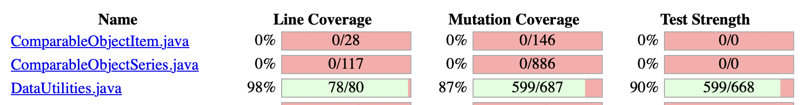
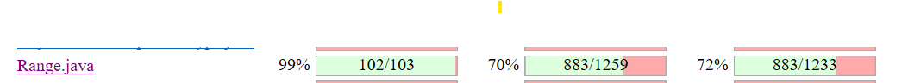


## \# of Mutations:

Range Class:

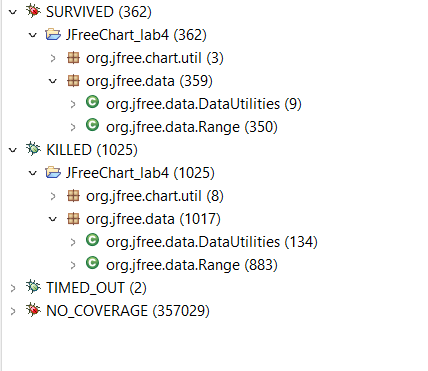

DataUtilities Class:
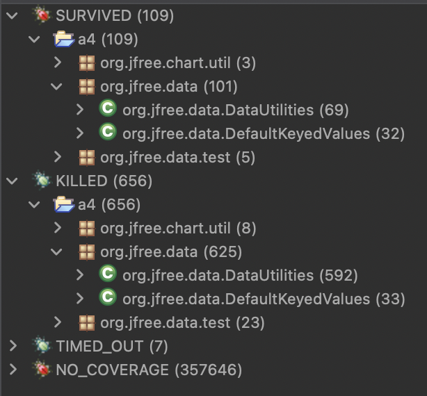


## Console Statistics:

Range Class:
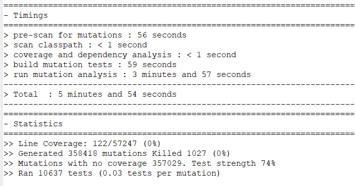

DataUtilities Class:
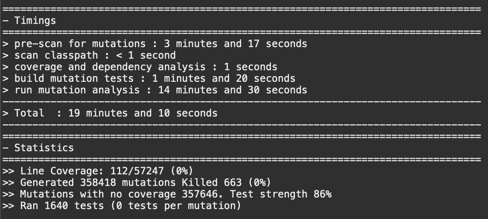


## 2.2 Mutants Analysis of the Range class 

10 muntants numbered from 1 to 10 were analyzed in the following section.The getCentralValue() method was examined to analyze mutant #1 to #6. Then contains() method was used to analyze mutant #7, and shiftWithNoZeroCrossing() method was used to analyze mutant #8 to #10.

The screenshot below shows the source code of getCentralValue() method. PIT injected 47 mutants to line 132 in the source code. 

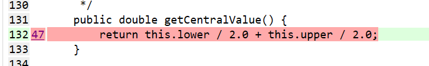

Below are the screenshot of 5 killed and 4 survived mutants. 

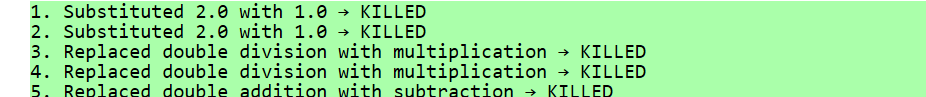
Figure 1. Killed Mutants of getCentralValue method

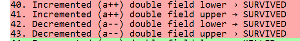
Figure 2. Survived Mutants of getCentralValue method

### Mutant 1 - Substituted 2.0 with 1.0 -> KILLED:

For the purpose of this lab report, mutant#1 and #2 in figure 1 "Substituted 2.0 with 1.0" were considered as 1 mutant. Line 132 in the source code was modified by PIT to 
- return this.lower / 1.0 + this.upper / 2.0;
- return this.lower / 2.0 + this.upper / 1.0;

The original code for this line is return this.lower / 2.0 + this.upper / 2.0;
 
 This mutant was killed by the following test case:
 ```
 @Test
    public void centralValueShouldBeHalfForNegativeRange() {
        Range negativeRange = new Range(-10, -2); // Range from -10 to -2
        assertEquals("The central value of -10 and -2 should be -6",
                -6, negativeRange.getCentralValue(), .000000001d);
    }
```
It was obvious that by "Substituted 2.0 with 1.0", the method returns a wrong result i.e. (-10/1 + -2/2 = -11 or -10/2 + -2/1 = -7 ) instead of -6. And this wrong result would be captured by the assert statement in the test case.

### Mutant 2 - Replaced double division with multiplaction -> KILLED

Mutant #3 and #4 in figure X were considered as one mutant. Line 132 of the source code was modififed to
- return this.lower * 2.0 + this.upper / 2.0
- return this.lower / 2.0 + this.upper * 2.0

This mutant was killed by the same test case in muntant 1 above for the same reason. It is obvious that replacing the division by multipliation would alter the result that the method would otherwise return.

### Mutant 3 - Replaced double addition with subtraction -> KILLED

This is #5 in figure 1 above. The source code was modified to:
- return this.lower / 2.0 - this.upper / 2.0

Again, this mutant was killed by the same test case mentioned in mutant 1 for the same reason mentioned in mutant 1 and 2. 

### Mutant 4 - Incremented (a++) double field lower/upper -> SURVIVED

Mutant #40 and #41 in figure 2 were considered as one mutant. Line 132 of the source code was modified to:
- return this.lower++ / 2.0 + this.upper / 2.0 
- return this.lower / 2.0 + this.upper++ / 2.0 

Because ++ is a post-increment operator, it has no impact to either this.lower or this.upper as the increment would not be evaluated at the time the return statement ran. In other words,
- this.lower has the same value as this.lower++
- this.upper has the same value as this.upper++

The following code snippet can be run in Eclipse to demonstrate the point mentioned.
```
int a = 6;
System.out.println(a); // the console would print 6
System.out.println(a++); //the console would also print 6
```
This mutant was actually equivalent to the original source code. Therefore, it survived all the test case designed. It was impossible to design a new test case to kill this mutant.

### Mutant 5 - Decremented (a++) double field lower/upper -> SURVIVED

Mutant #42 and #43 in figure 2 were considered as one mutant. Line 132 of the source code was modified to:
- this.lower has the same value as this.lower--
- this.upper has the same value as this.upper--

This mutant -- is also a post-decrement operator, which works the same way as explained in mutant 5. Again, this is an equivalent mutant that would always survive. 

The pre-increment mutant would be discussed next.

### Mutant 6 - Incremented (++a) double field lower/upper -> KILLED

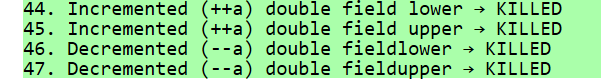

The source code is modified to:
- return ++this.lower / 2.0 + this.upper / 2.0 
- return this.lower / 2.0 + ++this.upper / 2.0

As opposed to the post-increment operator in mutant 4 and 5, the pre-increment operator mutant would be evaluated first. This means ++this.lower is 1 more than this.lower

The following code snippet can be run in Eclipse to demonstrate the point mentioned.
```
int a = 6;
System.out.println(a); // the console would print 6
System.out.println(++a); //the console would also print 7
```

 Therefore, this mutant was killed by our test case as shown in the screenshot above.


### Mutant 7 - Substituted 1 with -1 -> SURVIVED


The boolean contains() method below was examined next to analyse this mutant injected to line 144 which is the return line of the method.

```
  public boolean contains(double value) {
        return (value >= this.lower && value <= this.upper);
    }
```
It was unclear on how exactly the mutant would change the source code in this case as there is no 1 in the source code. Hence, one can only guess when analysing how this mutant survived the existing test cases.

It was assumed that PIT originally set this.lower = 1, then later changed it to -1. So originally, value >= 1 and then mutated to value >= -1 whlie (&& value <= this.upper) was fixed in both case. 

Any value that is greater than 1 is always greater than -1. Therefore, the existing test cases failed to kill this mutant. Similarly, this.upper can be modified while keeping this.lower unchange, and the result would be the same where the existing test cases failed to kill the mutant. 

Note that because it was unclear how PIT mutated the code, it was not possible to design new test cases to kill this mutant. And it was not possible to determine whether this is an equivalent mutant either although the testing team suspect it is.

### Mutant 8 - Substituted 0.0 with -1.0 -> SURVIVED

Below were the mutants injected to line 387 and the original source code of the shiftWithNoZeroCrossing() method.

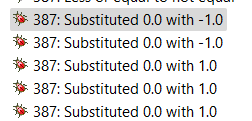

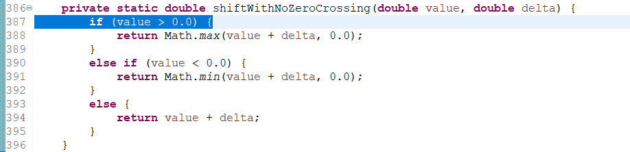

Line 387 was modified to if (value > -1.0) from if (value > 0.0).

It was obvious that if value > 0, it would be always greater than -1.0. This explains why the existing test cases failed to kill this mutant. 

Let's consider a test case where value = 0, and delta is an arbitary number, and let's invoke shifWithNoZeroCrossing(0, delta).

The original code returns 0 + delta.
The mutated code returns 0 + delta if delta is a positive, or 0 if delta is negative. 

It is unclear whether delta can be a negative number as this method was not included in the documentation. If delta can assume a negative value, then this mutant is a valid mutant which can be killed by the test case where value = 0.

If delta is always positive number, then this mutant is an equivalent mutant. 

### Mutant 9 - Substituted 0.0 with 1.0 -> SURVIVED

This mutant was a continuation of the same scenario in mutant 8. It was  injected to the same line in the source code as in mutant 8. 

Line 387 was modified to if (value > 1.0) from if (value > 0.0). At the first look, this mutant appeared to be a valid mutant that would be killed by a test case where value was set to 1. 

However, after a thorough analysis, this mutant was indeed an equivalent mutant. Let's considering a test case where value = 1, and delta be any arbitary number and let's invoke the method shiftWithNoZeroCrossing(1, delta).

The original unaltered source code with if (value > 0.0) would return 1 + delta according to line 388 (see source code in mutant 8).

With the mutant if (value > 1), the method still returned 1 + delta according to line 394. Again, this mutant would survive regardless. 

### Mutant 10 - Substituted 0.0 with -1 -> SURVIVED


This mutant was also a continuation of the source code used in mutant 8. It was injected in line 390 instead.

Line 390 was modified to if (value < -1.0) from if (value < 0.0). It is obvious that any value less than -1 also less than 0, this explains the existing test case cannot kill this mutant. 

This mutant can be possibly killed by setting a set case where value = -1.

The original code would return Math.min( -1 + delta, 0).
The mutated code would return -1 + delta. 

A similiar detail analysis in mutant 8 also applies to this mutant as they are similar in nature.


## 2.3 Analysis drawn on the effectiveness of each of the test classes

Below is the summary of the report generated by PIT in section 2.1.  

| Class           | Line coverage | Mutation coverage | Test Strength |
| ---------       |-----------    | ---------------   |---------------|
| Range           | 99%           | 70%               | 72%           |
| DataUtilities   | 98%           | 87%               | 90%           |

The existing test cases designed in previous assignment performed well to cover almost 100% of the line coverage. The test cases for DataUtilities class has done very well with 87% mutation coverage and 90% test strength. Since it is difficult and unrealistic to achieve a score of 100% for mutation coverage and due to the limited time and resource, the testing team considered these results satisfactory for the DataUtilities class. It is also believed that the equivalent mutants were the cause of the 10% missing in the test strength. An analysis of the mutants could be done to validate this point but it takes a lot of effor to do so.

The statistic of the Range class is not as good as the DataUtilities class, at 70% mutation coverage and 72% test strength. However, these number are still considered good. The team tried to improve these score by performing an analysis on the mutants as showed in section 2.2. 

According to the screenshot in section 2.1, PIT generated a total of 1245 mutants on the Range class in which 883 (70%) were killed, and 362 (30%) survived.

After a careful analysis of the mutant report, it was notice that there are a large amount of equivalent mutants generated. The screenshot below show an example. This a-- and a++ mutants has been proven to be an equivalent mutant in section 2.2 mutant #4 and #5.

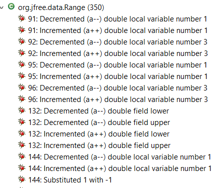

The testing team quickly counted the number of these mutants. The count number was suprisingly high at roughly about 100 (out of 362 survived). This is 27% of the survived mutants. Removing them would bring the total number of mutants down to 1145, thus enhance the testing strength to 883/1145 = 77%, a 7% increase. 

The second equivalent mutant (mutant #9) found in section 2.2 occurs about 6 times in the code. Due to time constraint, it was not possible to analyse all 362 mutants. It is also difficult to prove if a mutant is an equivalent one where it was unclear what PIT did to the source code (as shown in mutant#7 in section 2.2) or insufficient information was provided in the documentation (mutant#8 and 10 in 2.2).

The testing team were confident that there are more equivant mutants generated by PIT that went undetected. It is most likely that the mutation coverage strengh will improve more than 10% after removing most if not all equivalent mutants. 

## 2.4 Effect of equivalent mutants on mutation score accuracy

As discussed in section 2.3, the equivalent mutants would reduce the mutation score accuracy. 

Since the mutation score strength =  the # mutants killed/ # total mutants.
The equivalent mutants would make the #total muntants larger than it should be, causing the reduction in the score. This undermines the actual strength of the test case desgined. 

Note that it is not possible to kill the equivalent mutants. 
 
## 2.5 How to improve the mutation score of the test suites

To improve the mutation score, there are two ways according to the formula in section 2.4:
- Remove the equivalent mutants which decreases the total number of mutants
- Design new test case to kill valid mutants which increase the # mutant killed

The testing team did a research online to find if there is an easy way to identify equivalent mutants. But the result was quite disapointing. The methods available either required extentsive mathematical proof, or advanced software with high computational power. Detecting equivalent mutants is a big topic. It did take a great effort for the testing team to analyze the code manually to identify the equivalent mutants. 

The testing team, however, discovered a pattern that it is very likely that a mutant is an equivalent one if its appearance frequency is high. As mentioned in section 2.3, the equivalent mutant a++ and a-- appeared about 100 times in the report. The higher the appearance frequency, the more likely it is an equivalent mutant. Although this is not always true, it is a quick way to identify equivalent mutant.

## 2.6 Reason or mutation testing - Advantages and disadvantages 

Although complicated and difficult to implement, mutation testing is required to detected bugs that cannot be otherwise detect by other methods. Especially for mission critical software, it is vital to catch as nearly 100% of bug as possible. An example would be the software that controls a spaceship which worths over 100 millions dollars, and carries a crew of 4 people (life is involved). By injecting mutant (error) into the source code, mutation testing can identify bug that would not be possible to catch.

Advantage:
- Effective in identify bugs
- Improve code quality by remove logical error or code redundancy
- Improve code coverage

Disavantage: 
- Very time consuming and take a lot of effort to analyse and understand source code
- Difficult to design valid mutant that is not equivalent to the original code
- Difficult to detect the equivalent mutant
- The equivalent mutant undermine the accuracy of the score

# 3 GUI Testing
## 3.1 Explain your SELENUIM test case design process

The testing team selected the [**Home Depot Canada**](https://www.homedepot.ca/en/home.html) website to learn automated and manual GUI testing.

While exploring the site, the testing team discovered a series of functionalities that a user might regularly perform on the site such as changing store location, checking weekly flyer, searching for items, etc.

Then the test cases wered designed based on these functionalities combining with a regular shopping scenario. The scenario is that a person is looking to shop for some tools at Home Depot.

First, he would go to the website and find a store nearby. Then, he will check to see if there's any good deal by checking the weekly flyer on the website. He does not see the items he wanted on the flyer, so he performs a search for what he needs, either through the search box or through the pre-set categories on the website.

Once found, the items would be added to the shopping cart. He may add too many that he needs to remove some items from the cart. He may also have questions about the product that he uses the live chat function on the website, and use the product comparison function to find the best deals. 

Then he realizes he only used the tool once, so it may be better to rent than to buy. So he explores the rental option on the website. Once make up his mind, he creates an account and log-in to finalize his shopping. 

### 3.1.1 Test Cases

The 10 test cases identified are as follows:

1. Changing store location
1. Check weekly flyer - any good deal
1. Searching a specific item - through the pre-set button or textbox
1. Add item to cart
1. Remove item from cart
1. Live chat function
1. Product comparison
1. Searching for tool rental
1. Create an account
1. Log-in

Following are a detail descriptions of test case #3 and #6 to demonstrate the process that the testing team did. Considering the length of the report, a detail descriptons of the other test cases were not included as they were self-explanatory and the Selenium recording were included with this report. Note that the testing team applied various assertions and checkpoints together with using different test data in the test cases.

#### Searching a specific item - through the pre-set button or textbox

**Text Box:**

Searched for "sand paper" as well as misspelled "snad pappor" to find _Diablo 12-inch x 18-inch Medium Finish 120 Grit PSA Sand Paper Sheet for Wood/Metal/Plastic Sanding_ with _Store SKU # 1000722077_. Both tests were successful.

To further explore test cases using the search box, we also searched for a special character "?" as well as numbers "123456789" these tests were successful. These tests produced search results.

We also tried to search for a blank space or a series of blank spaces but the page reloads and no search is performed.

Selenium IDE Test Names:

-   search for "sand paper"
-   search for "snad pappor"
-   search for "?"
-   search for "123456789"

Verification points used:

-   assert element present - used to assert that the search input field is present on the page. We cannot search for an item without the field so assert is used to stop the test if the input search field is not present.
-   verify title - used to verify the title of the webpage. This reflects the word or phrase searched followed by " | Search Results from The Home Depot Canada"
-   assert element present - used to assert that the sku field is on the resulting page
-   verify text - used to verify that the sku found on the resulting page matches the value of the item we were searching for.

**Popular Searches Button:**
Selenium IDE Test Names:

-   search by popular searches button

Used the popular search buttons to select _Backsplash Tile_ and then make a selection of tile _Enigma 3-inch x 6-inch Metro White Matte Pressed Ceramic Wall Tile (10.66 sq.ft. / case)_ with _Store SKU # 1001674114_. As this is a predefined button, the only alternate values to test are other products on the results page. These will yield equivalent results and were not explicitly tested.

Verification points used:

-   assert element present - used to assert that the Popular Searches buttons are present on the page. We cannot use these buttons if they are not present.
-   assert element present - used to assert that the sku field is on the resulting page
-   verify text - used to verify that the sku found on the resulting page matches the value of the item we were searching for.
-   verify title - used to verify the title of the webpage. The title should be the name of the selected item followed by " | The Home Depot Canada".

**Shop by Department Menu:**
Used the popular search buttons to select _Shop by Department_, _Building Materials_, _Ladders & Scaffolding_ and _Step Ladders_ then make a selection of _Featherlite 4 ft. Lightweight Grade III Aluminum Step Ladder with Slip-Resistant Rubber Feet_ with _Store SKU # 1000414605_. As this is a predefined menu with explicit options for selection, any menu selection will yield equivalent results to any other menu selection.

Selenium IDE Test Names:

-   search by department

Verification points used:

-   assert element present - used to assert that the Shop by Department menu is present on the page. We cannot use the menu if it is not present therefore we have asserted this element.
-   verify title - used to verify the title of the webpage. This reflects the menu selected followed by " - Homedepot.ca"
-   verify text - used to verify that the sku found on the resulting page matches the value of the item we were searching for.

#### Using the Live Chat

Attempted to use Selenium to interact with the live chat feature. This was unsuccessful, likely by design. The IDE can be used to open the chat feature, select pre-defined prompts, type in the text area, and close the chat. We cannot use Selenium to send the message typed in the text area.

Selenium IDE Test Names:

-   live chat follow prompts
-   live chat type question (fails)

Verification points used:

-   assert element present - used to assert that the "Customer Support" link was present on the page.
-   assert element present - used to assert that the "Need Help? Chat live with an associate" link was present on the page.
-   verify element present - used to verify that Selenium can find the close X to end the chat

The live chat following the prompts resulted in no new information gained as the prompts themselves were very rudimentary and don't offer any actual information about the selected items. For example, we were interested in more information about kitchen appliances and the tool offered to connect us to another chat bot / person. Transcript of conversation can be found below.

Typing a prompt into the text area was successful but we were unable to send an enter key with the keyboard. This is an excellent measure on the company's behalf to prevent bad actors from performing scripted actions with the live chat. Screenshot of conversation can be found below.

Live chat transcript - Following Prompts:

```
The Home Depot (3/21/2024, 1:03:36 PM): Welcome! I'm The Home Depot Virtual Assistant.
The Home Depot (3/21/2024, 1:03:38 PM): What can I help you with today? Ask me a question or select an option below.
The Home Depot (3/21/2024, 1:03:40 PM): Menu Options:
	Help With an Existing Order
	Product Information
	Damaged or Missing Item
	Return an Item
	Current Promotions
null (3/21/2024, 1:03:40 PM): Product Information
The Home Depot (3/21/2024, 1:03:43 PM): We'd be happy to help you with your product information inquiry.
The Home Depot (3/21/2024, 1:03:45 PM): Please select an option:
The Home Depot (3/21/2024, 1:03:48 PM): Menu Options:
	Product Stock
	Pricing and Specifications of a Product
	Product Recommendations
	Promotions
	Warranty
null (3/21/2024, 1:03:48 PM): Product Recommendations
The Home Depot (3/21/2024, 1:03:51 PM): What are you looking for recommendations on?
The Home Depot (3/21/2024, 1:03:53 PM): Menu Options:
	Appliances
	Tools
	Furniture
	Other Products
null (3/21/2024, 1:03:53 PM): Appliances
The Home Depot (3/21/2024, 1:03:56 PM): What type of appliance are you looking for?
The Home Depot (3/21/2024, 1:03:58 PM): Menu Options:
	Kitchen Appliance
	Laundry Appliance
	Other
null (3/21/2024, 1:03:58 PM): Kitchen Appliance
The Home Depot (3/21/2024, 1:04:01 PM): Would you like to speak to an associate for further assistance?
The Home Depot (3/21/2024, 1:04:03 PM): Button Selections:
	Yes
	No
null (3/21/2024, 1:04:03 PM): No
```

Live Chat typing question into text area:

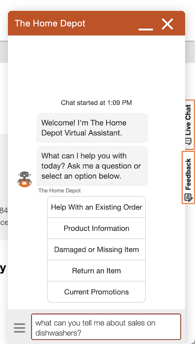

## 3.2 Explain the use of assertions and checkpoints

From the [Selenium IDE Documentation](https://www.selenium.dev/selenium-ide/docs/en/api/commands): The test will stop if the assert fails and the test will continue even if the verify fails.

Assertions and checkpoints will help verify that the application behaves as expected during the test execution.

Assertions: Assertions are used to verify that a certain condition is true at a specific point in the test. If the assertion fails, the test will stop immediately, and an error will be reported. Assertions are typically used to verify critical conditions that, if not met, indicate a serious issue with the application under test.

Checkpoints: Checkpoints are similar to assertions but are used to verify non-critical conditions. If a checkpoint fails, the test will continue running, and the failure will be recorded. Checkpoints are useful for verifying the state of the application at various points during the test, allowing testers to gather more information about the application's behavior without halting the test execution.

## 3.3 Test Data
For functionalities that required input data such as log-in and search items, various input data was used for testing as described thoroughly in the sample test case description in section 3.1.1. Wherever possible and as time allowed, invalid input data was used for testing as well. In the log-in case, the testing team alternate between valid and invalid username and password. 

# 4 Reflection

## 4.1 How the team work/effort was divided and managed

| Test Case                 | Name    |
| ------------------------- | ------- |
| Changing store location   | Hao     |
| Check weekly flyer        | Hao     |
| Searching a specific item | Jenn    |
| Add item to cart          | Eric    |
| Remove item from cart     | Eric    |
| Live chat function        | Jenn    | 
| Product comparison        | Corey   |
| Searching for tool rental | Corey   |
| Create an account         | Mehreen |
| Log-in                    | Mehreen |

## 4.2 Difficulties encountered, challenges overcome, and lessons learned

- Some of the mutants in PIT are difficult to intepret what was mutated. It takes quite sometime to get familiar with the PIT report and navigate through the summary to extract useful information.

- It takes time and effort to prove if a mutant is an equivalent mutants. Quite often a deep analysis was required to do so. There were many survived mutants that going through all of them were impossible.

- It takes sometime to get familiar with Selenium after consulting with many tutorial source.

- Instructions don't say what we are supposed to do with Sikulix

## 4.3 Comments/feedback on the assignment itself
After completing the assignment, the testing team had a better understanding of mutant testing and GUI testing. It was good that the assignment introduce a real life scenario in the GUI tesing using Selenium, a tool used by the industry. Although the team tried to keep the report at a minimal length, it was difficult as there were many aspects needed to be include in order to make the report clear to the reader.